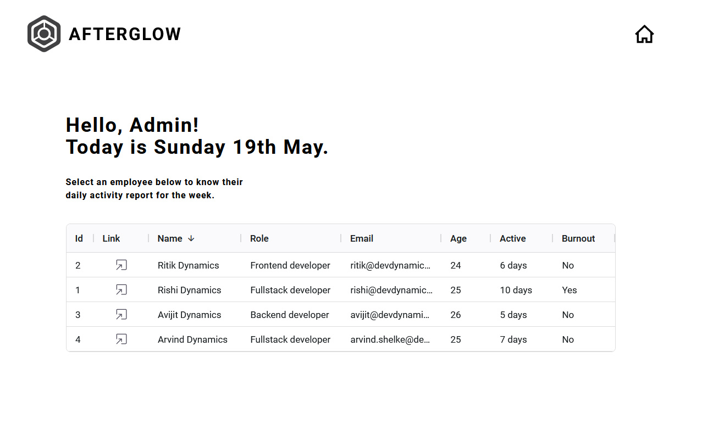
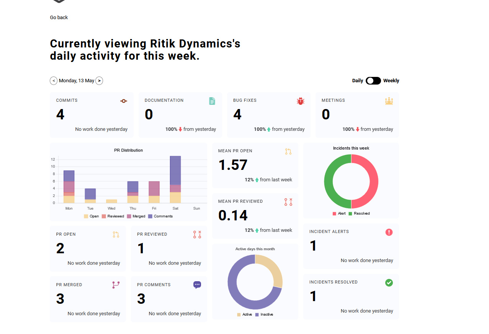
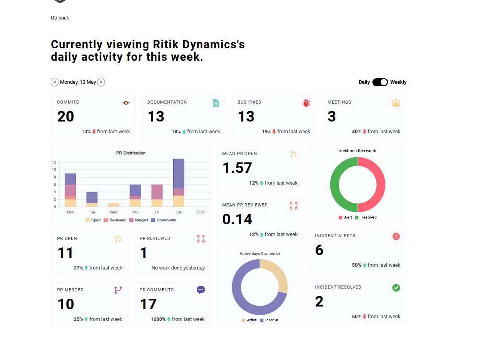

# Dev Dynamics internship assignment submission.

## Table of contents

- [Overview](#overview)
  - [Personal](#personal)
  - [Objective](#objective)
  - [Screenshot](#screenshot)
  - [Links](#links)
- [My process](#my-process)
  - [Built with](#built-with)

## Overview

### Personal

This git repository is for the DevDynamics internship assignment submission.

Submission by:-

Name:- Mohsin Miyaji
Email:- mohsin.kmiyaji@gmail.com
college:- Vishwakarma Institute of information technology

### Objective

Create a simple dashboard that visualises organisation developers activity data throughout the day for a week time. Activities are like committing the code, opening the pull request, merging the pull request, attending the meetings and writing the documentation.

### Screenshot

### Links

- GitHub URL: [Add solution URL here](https://github.com/mohsin316/devdynamics-assignment)
- Live Site URL: [Add live site URL here](https://employeeactivitydashboard.netlify.app/)

## My process

I built this with the help of react, typescript and chartJs. The website is split into 2 pages, The home page and the employee detail page. The home page shows the employees and some basic information. the employee detail page shows each specific employees details in the form of a dashboard.

The dashboard uses 1 week worth of data. It displays the daily and weekly activities of the employee. The data is also compared to the previous day or the previous week.

### Built with

- Semantic HTML5 markup
- CSS custom properties
- Flexbox
- CSS Grid
- React
- Typescript
- Chartjs
